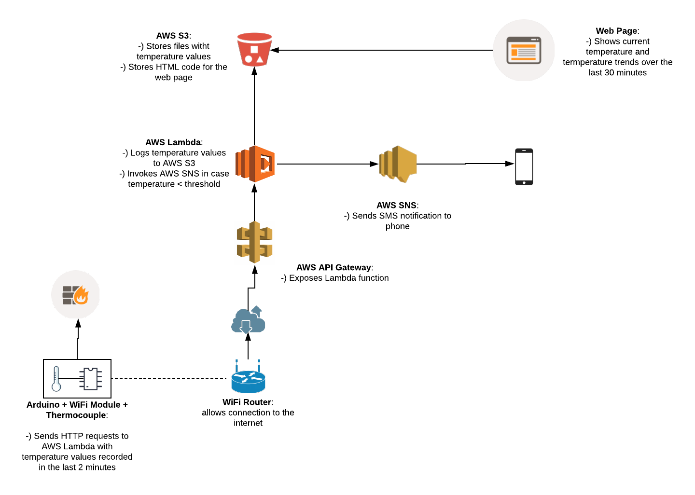

# Clever BBQ
Arduino and AWS integration to monitor temperature in a barbeque.

## High Level Diagram



## S3 structure:

- cleverbbq
    - static-website
    - temperature_data
        - 20180409
            - log_[TIMESTAMP].json


## JSON config

The S3 bucket stores a json file that contains the configuration needed to log and alert. 

```json
{
  "lower-threshold": 40,
  "upper-threshold": 45,
  "records-to-consider": 5,
  "alert-interval": 1000,
  "slope-coeff": -0.3,
  "sns-topic": "",
  "alert-table": "alert_history",
  "temperature-data": "temperature_data"
}
```

The first 5 entries are used to establish when to send an alert:
    
    - lower-threshold and upper-threshold: range of Celsius degrees that should trigger an alert
    - records-to-consider: how many event the script considers to calculate the slope coefficient of the temperature trend
    - alert-interval: represents the minimum time interval between 2 alerts (we don't want to send an alert if one has just been sent)
    - slope-coeff: if the temperature trend coeff is smaller than this value we want to trigger an alert
    
The last 3 entries are application specific configurations.

## Alerting logic

The below is the pseudo code that controls the logic of the alerts

```pseudo
if temperature between lower-threshold and upper-threshold:
    if enough time from last alert:
        is slope < slope-coeff:
            send_alert
```

Logic explained:
    
    1. The first if statement checks if the temperature is in the range of what we define as low temperature through the configuration parameters lower-threshold, upper-threshold
    2. The second if checks that enough time has elapsed from the last alert
    3. The last if statement instead checks the temperature trend: a negative slope means that the temperature is decreasing. 
 